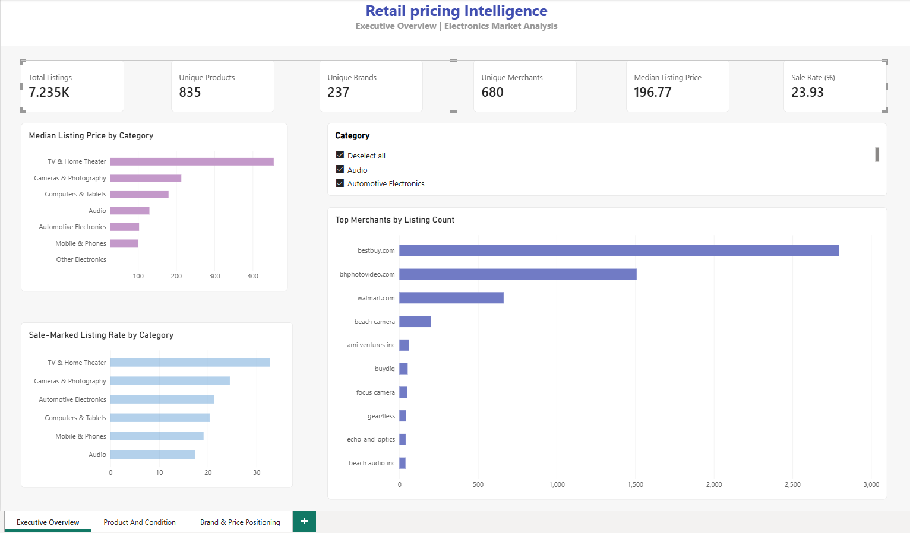
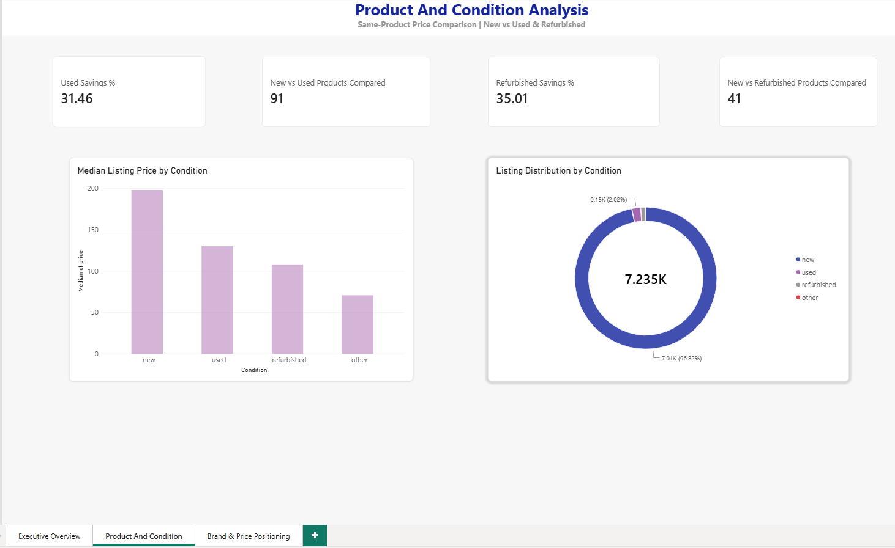
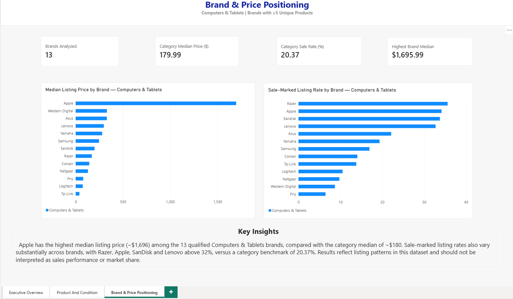

# 🛒 Retail Pricing Intelligence

**Python • Pandas • Power BI • DAX • Power Query • Data Analytics**

An end-to-end retail analytics project that transforms messy electronics pricing data into actionable pricing and competitive insights using **Python and Power BI**.

The project analyzes **7,235 retail listings across 835 products, 237 brands, and 680 merchants** to investigate pricing position, promotional activity, merchant concentration, and the value of used and refurbished products.

## 🎯 Business Problem

Retail pricing data is often fragmented across products, brands, merchants, conditions, and promotional states. Raw listing data alone does not clearly answer questions such as:

- How does pricing vary across product categories and brands?
- Which categories and brands have more sale-marked listings?
- How concentrated are listings across merchants?
- How much can customers save by choosing used or refurbished versions of the same product?
- Which brands occupy higher or lower price positions within a category?

This project builds a reproducible analytical workflow to turn raw listing data into decision-ready insights.

## 📊 Dashboard

The Power BI report contains three analytical views:
### Executive Overview



### Product & Condition Analysis



### Brand & Price Positioning



### 1. Executive Overview
Provides a high-level view of:
- Total listings, products, brands, and merchants
- Median listing price
- Sale-marked listing rate
- Category-level pricing
- Promotional activity by category
- Merchant listing concentration

### 2. Product & Condition Analysis
Examines the relationship between product condition and price, including **same-product comparisons** to avoid misleading conclusions caused by different product mixes.

### 3. Brand & Price Positioning
Compares brands within **Computers & Tablets**, using a minimum threshold of **5 unique products per brand** to reduce the influence of very small samples.

## 🔍 Key Findings

- **7,235** valid USD electronics listings were retained after cleaning.
- The dataset contains **835 unique products**, **237 brands**, and **680 merchants**.
- Overall median listing price is approximately **$196.77**.
- **23.93%** of listings are marked as being on sale.
- **TV & Home Theater** has the highest median category price at approximately **$454.95** and the highest sale-marked listing rate at **32.72%**.
- The three most represented merchants account for approximately **68.64% of listing records in the dataset**.
- Across **91 products** available in both new and used condition, the median used price is approximately **31.46% lower** than the same product's median new price.
- Across **41 products** available in both new and refurbished condition, the median refurbished price is approximately **35.01% lower** than the same product's median new price.
- Within Computers & Tablets, substantial differences exist in both median listing price and sale-marked listing rates across sufficiently represented brands.

## 🧠 Analytical Approach

The analysis follows:

**Raw Data → Data Quality Investigation → Cleaning → Feature Engineering → Exploratory Analysis → KPI Development → Power BI Dashboard**

Key methodological decisions include:

- Using **median price** because listing prices are strongly right-skewed.
- Standardizing brand, merchant, condition, availability, and shipping fields.
- Removing clearly implausible sub-$5 electronics listings while retaining plausible premium products.
- Comparing brands within a product category rather than relying only on potentially misleading global brand averages.
- Requiring at least **5 unique products** for detailed brand comparisons.
- Matching the **same products across conditions** before estimating used/refurbished savings.
- Treating merchant representation as **dataset concentration**, not real-world market share.

## 🛠️ Tools & Technologies

- **Python**
- **Pandas**
- **NumPy**
- **Jupyter Notebook**
- **Power BI**
- **DAX**
- **Power Query**
- **Git & GitHub**

## ⚠️ Limitations

This dataset contains retail listing information rather than transaction-level sales data.

Therefore:

- Sale flags indicate promotional labeling, not actual discount magnitude.
- Merchant listing share should not be interpreted as market share.
- Availability should not be interpreted as customer demand.
- Shipping information is incomplete for a substantial portion of listings.
- Results describe patterns in this dataset and do not establish causal relationships.

## 📁 Project Structure

```text
retail-pricing-intelligence/
│
├── dashboard/
│   └── Retail-Pricing-Intelligence.pbix
│
├── data/
│   └── processed/
│
├── notebooks/
│   ├── 01_data_cleaning.ipynbgit commit -m "Improve project README"
│   └── 02_eda.ipynb
│
├── img/
├── requirements.txt
└── README.md

## 👤 Author

 **Israt Jabin**  
Computer Science | Data Analytics 